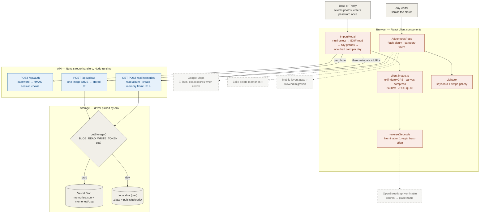

# Trin and Basti Adventures — system design

> How a camera roll becomes **the story of a relationship**.
>
> Photos are selected in bulk in the browser, grouped into *memories* by the
> day their EXIF says they were taken, prefilled with date and reverse-geocoded
> location, and given one human-written description per day. Each photo is
> compressed client-side and uploaded one request at a time to Vercel Blob; the
> album itself is a single JSON manifest beside the images — no database. The
> **north star** is Trinity opening the site on her phone and scrolling a year
> of her life, told in Basti's words.

This document is the developer-facing map of the whole system — every
component, **built or planned**, and how data moves between them. Read the
flowchart top-to-bottom; dashed nodes are the roadmap.

---

## Table of Contents

1. [End-to-end flowchart](#end-to-end-flowchart)
2. [The three flows that matter](#the-three-flows-that-matter)
3. [How a bulk import works, end to end](#how-a-bulk-import-works-end-to-end)
4. [Subsystem deep dives](#subsystem-deep-dives)
5. [Component inventory](#component-inventory)
6. [Design decisions](#design-decisions)
7. [Build stages](#build-stages)

---

## End-to-end flowchart

**Legend** — 🟧 browser (React) · 🟦 API (route handlers) · ⬜ storage / users ·
◌ dashed = planned or external.

---

## The three flows that matter

1. **A memory is a day, not a photo.** Twelve shots from the Tea Garden are one
   memory: one title, one place, one description, twelve photos. This is what
   makes importing hundreds of photos humanly finishable — you write ~1
   description per day, not per frame. The grouping key is the EXIF
   `DateTimeOriginal` calendar day; photos with no EXIF land in an "undated"
   group that gets a hand-set date.
2. **The browser does the heavy lifting; the server is thin.** EXIF reading,
   day-grouping, compression (16.5MB phone photo → ~750KB), and geocoding all
   happen client-side. The API only authenticates, stores bytes, and appends to
   the manifest. This is what keeps every request under Vercel's 4.5MB body cap
   and the whole system free-tier.
3. **One JSON manifest is the whole database.** `memories.json` lives beside
   the images in the same store and is read once per page load. A few hundred
   memories ≈ a few hundred KB. First read seeds it from
   `src/data/seed-memories.ts`; after that the manifest is the only truth.
   Storage is behind a ~40-line driver interface, so local dev uses plain disk
   and a future move (e.g. Supabase) is one file.

---

## How a bulk import works, end to end

Trace one real event — 40 photos from a February trip are selected in the
import modal:

1. **Authenticate once.** `GET /api/auth` says whether this device already has
   a session cookie. If not, the shared password (`ALBUM_PASSWORD`) is posted;
   a correct answer sets an httpOnly HMAC cookie good for a year. Failure in
   production with the variable unset refuses uploads entirely — fail closed.
2. **Read and group.** `exifr` pulls `DateTimeOriginal` and GPS from each file
   (local time, no UTC shift). Files bucket by calendar day —
   say Feb 15 (18 photos), Feb 16 (13), Feb 17 (9) — and each bucket becomes a
   draft card, dated, with previews.
3. **Geocode in the background.** For each day with GPS, Nominatim resolves
   coordinates to "Palace of Fine Arts, San Francisco, California" — one
   request per second (their terms), never blocking, blank on failure. The
   user is writing three descriptions meanwhile.
4. **Compress and upload, one photo per request.** Each file is re-encoded on a
   canvas — longest edge 2400px, JPEG q0.82, EXIF orientation applied so
   portraits don't arrive sideways — and posted to `/api/upload`, which
   validates type and size and returns the stored URL. A progress bar counts
   40 uploads; a 401 mid-run bounces to the password screen.
5. **Create the memories.** For each day, `POST /api/memories` sends the
   metadata plus its photo URLs. The server validates, assigns UUIDs, takes the
   memory's map pin from the first photo that had GPS, appends to the manifest,
   and rewrites `memories.json`.
6. **Render.** The album refetches: three new memories slot chronologically
   among the rest, each card fronted by its cover photo with a "+N more" badge;
   tapping opens the lightbox gallery.

---

## Subsystem deep dives

### 1. Import pipeline (client)

`ImportModal` is a five-phase state machine: `password → pick → reading →
review → uploading`. `grouping.ts` owns the pure logic (metadata read, day
bucketing, undated handling) so it stays testable; the modal owns phase state
and progress. Failure mid-upload keeps already-created memories and reports
the error — resume is manual (re-select the remaining days). Full spec:
[docs/03-import-spec.md](docs/03-import-spec.md).

### 2. Storage drivers

`getStorage()` returns the Blob driver when `BLOB_READ_WRITE_TOKEN` is set,
else local disk (`.data/` for the manifest, `public/uploads/` for images —
both git-ignored). The interface is three methods: `readManifest`,
`writeManifest`, `saveImage`. The Blob manifest is written with
`addRandomSuffix: false, allowOverwrite: true, cacheControlMaxAge: 0` so it
stays at a stable URL and is never stale; images get random suffixes and are
immutable. Last-write-wins on the manifest — acceptable at two users, revisit
only if simultaneous imports become real. Schema:
[docs/02-data-model.md](docs/02-data-model.md).

### 3. Auth

One shared password for two people. `POST /api/auth` compares against
`ALBUM_PASSWORD` via SHA-256 digests under `timingSafeEqual`, then sets an
httpOnly, sameSite=lax cookie holding an HMAC derived from the secret — so a
cookie can be re-verified statelessly and a leaked cookie value is not the
password. Reads are public; only writes are gated.

### 4. Album view

`AdventuresPage` fetches `/api/memories` once, pins the `featured` memory to
the hero slot, sorts the rest oldest-first (the album reads as a story), and
filters by category — filter chips render only for categories that actually
contain memories. `Lightbox` handles arrows/Escape on desktop and swipe on
mobile, locks page scroll while open, and thumbnails the current memory's
photos.

---

## Component inventory

| Component | Layer | Tech | Status | Where |
|---|---|---|---|---|
| Album page + category filters | Web | React client | ✅ built | `src/components/AdventuresPage.tsx`, `PhotoGrid.tsx` |
| Memory cards + featured hero | Web | React · next/image | ✅ built | `src/components/PhotoCard.tsx`, `FeaturedMemory.tsx` |
| Lightbox gallery (keys + swipe) | Web | React | ✅ built | `src/components/Lightbox.tsx` |
| Relationship timer | Web | React | ✅ built | `src/components/Header.tsx` |
| Bulk import modal (5-phase) | Web | React | ✅ built | `src/components/ImportModal.tsx` |
| EXIF read + canvas compression | Client lib | exifr · canvas | ✅ built | `src/lib/client-image.ts` |
| Day-grouping | Client lib | TS | ✅ built | `src/lib/grouping.ts` |
| Reverse geocoding | Client lib | Nominatim | ✅ built | `src/lib/client-image.ts` |
| Auth (password → HMAC cookie) | API | Node crypto | ✅ built | `src/lib/auth.ts`, `src/app/api/auth/` |
| Image upload endpoint | API | route handler | ✅ built | `src/app/api/upload/route.ts` |
| Memories read/create endpoint | API | route handler | ✅ built | `src/app/api/memories/route.ts` |
| Storage driver — local disk | Storage | fs | ✅ built | `src/lib/storage.ts` |
| Storage driver — Vercel Blob | Storage | @vercel/blob | ✅ built, verified in prod 2026-08-13 | `src/lib/storage.ts` |
| Production deploy (env vars + Blob store) | Ops | Vercel | ✅ live — `anniversary-one-taupe.vercel.app` | Vercel dashboard |
| Edit / delete memories | Web + API | — | ⬜ Stage 4 | — |
| Mobile layout pass (Tailwind migration) | Web | Tailwind | ⬜ Stage 5 | — |
| Seed image compression, favicon, OG image | Polish | — | ⬜ Stage 6 | `public/`, `src/app/` |

---

## Design decisions

| Decision | Choice | Why |
|---|---|---|
| Who it's for | Two people, one shared password — no accounts | It's a gift, not a product. Auth is one env var and a cookie |
| Unit of the album | **Memory = a day** with many photos, not photo-per-card | Hundreds of photos means hundreds of captions nobody will write; ~1 description per day is finishable. Decided 2026-08-12 |
| Storage | Vercel Blob + JSON manifest, **no database** | Supabase free tier pauses after 7 days idle — fatal for a site visited occasionally. Blob doesn't pause; 1GB ≈ 1,300 compressed photos. Decided 2026-08-10 |
| Storage coupling | 3-method driver interface, local-disk driver for dev | Dev works with zero accounts; a future Supabase move is one ~40-line file |
| Upload shape | Two-phase: N × `/api/upload`, then one `/api/memories` | Vercel serverless caps request bodies at 4.5MB; a 12-photo day in one request would fail only in production |
| Compression | Client-side canvas, 2400px longest edge, JPEG q0.82 | 16.5MB phone photo → ~750KB before it leaves the device; keeps Blob and bandwidth free-tier |
| HEIC | Rejected server-side; client re-encodes to JPEG | Browsers can't render stored HEIC; iOS Safari converts on file-pick anyway |
| Date/location entry | EXIF `DateTimeOriginal` + GPS autofill, Nominatim reverse geocode | Verified against real photos — EXIF matched hand-typed dates exactly. Typing metadata 300 times is the failure mode |
| Geocoding | Best-effort, 1 req/s, never blocks | Nominatim usage policy; a blank location field beats a stuck import |
| Auth failure mode | `ALBUM_PASSWORD` unset in prod ⇒ uploads refused | Fail closed — never an open write endpoint on a public URL |
| Date display | Format in UTC | Bare-date parsing yields UTC midnight; local formatting shows "the day before" west of Greenwich |
| Design language | Keep the original neutral grey — **settled with Basti 2026-08-10** | Photos vary wildly in color; the writing is the emotional core and neutral styling keeps it loudest. No redesigns unprompted |
| Manifest concurrency | Last-write-wins, no locking | Two occasional users; a lock scheme is complexity without a customer |

---

## Build stages

Detail and exit criteria live in
[docs/01-implementation-pipeline.md](docs/01-implementation-pipeline.md).

| Stage | Name | Status |
|---|---|---|
| 0 | Static album — hardcoded photos, timer, map links | ✅ done (July 2025) |
| 1 | Persistent uploads — storage drivers, auth, EXIF autofill | ✅ done 2026-08-10 (single-photo modal, superseded by Stage 2) |
| 2 | Memories model + bulk import + lightbox | ✅ done 2026-08-12, verified end-to-end locally |
| 3 | Ship — Blob store + env vars, deploy, real import verified live | ✅ done 2026-08-13 |
| 4 | Manage — edit/delete memories | ⬜ **next candidate** |
| 5 | Mobile layout pass — Tailwind migration, responsive type/spacing | ⬜ |
| 6 | Polish — compress seed PNGs, favicon, OG link preview | ⬜ |
