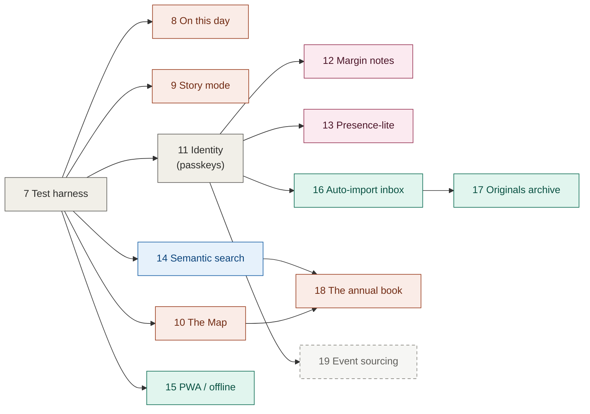

# The dream roadmap — Stages 7–19

> What this album becomes if we never run out of time.
>
> Stages 0–6 built a photo album that works. This document specs what it
> could *become*: the map of a relationship drawn on the earth, the year as
> cinema, the album as a conversation between two voices, search that
> understands "us laughing," a book on the shelf every July. Every stage is
> additive, independently shippable, and reversible — the gift is never at
> risk from its own ambitions.

**Status: unscheduled.** Nothing here is committed work. Stages are ordered
by dependency and value-per-effort; any contiguous prefix is a coherent
stopping point. Build order within a wave is negotiable; across waves it
mostly isn't (see the dependency map).

---

## Invariants — what mayhem may never touch

These outrank every stage below. A stage that can't be built inside them
gets redesigned, not excepted (the one deliberate exception is flagged
where it occurs).

1. **The gift keeps working.** Every stage ships dark or additive: new
   routes, new views, new fields — never a breaking change to what Trinity
   already opens. Rollback for any stage is `git revert` + redeploy.
2. **The neutral design holds.** New surfaces (map, story mode, book)
   inherit the grey/white system, the Playfair/Helvetica pairing, and the
   parity layer. Prominence through typography and layout, never palette.
3. **Privacy stance: no third-party data processors.** Photos, words, and
   derived data (embeddings, presence) live in our own storage and compute
   in the browser or our own functions. Nominatim (existing, best-effort,
   anonymous coordinates only) remains the sole outside call.
4. **Two people.** Identity work (Stage 11) distinguishes Basti from
   Trinity; it never becomes accounts, tenancy, or growth machinery.
5. **The manifest stays the source of truth** — until Stage 19 explicitly
   and reversibly supersedes it, and not before.
6. **Free tier by default.** A stage with real money attached says so in
   its header. Current budget reality: Blob 1GB / 10GB-month, Vercel Hobby,
   Blob ops quota **10k simple / 2k advanced per month** — quota-hungry
   designs are called out per stage.

---

## Dependency map

**Waves:** infrastructure (7) → delight (8–10) → identity & social (11–13)
→ intelligence (14) → resilience (15–17) → the book (18) → capstone (19).

---

## Stage 7 — Test harness & CI ⬜

*Everything after this stage is guarded by it; that's why it goes first
despite being the least romantic item on the list.*

Playwright end-to-end suite against the dev server with seeded `.data/`
fixtures, plus visual regression, plus GitHub Actions CI on every PR.

- **E2E flows:** browse + lightbox navigation; unlock; bulk import with a
  fixture batch (EXIF grouping, merge-into-existing, undated); cover
  change; edit/remove/delete with confirms; retry-idempotency (kill the
  network mid-import, resubmit, assert no duplicates — the exact scenario
  the Stage 4 review panel confirmed and fixed).
- **Visual regression:** screenshot snapshots at 375 / 768 / 1280 for the
  album, lightbox, and import review screen. This pins the parity layer —
  the Stage 5 lesson ("verifying sizes isn't verifying parity") made
  permanent.
- **Fixtures:** synthetic JPEGs with real EXIF written by a script
  (piexifjs) — no personal photos in the repo or CI logs, per the same
  hygiene rule Centavo uses for bank data.
- **CI:** Actions workflow: typecheck → build → e2e → visual diff. Vercel
  preview deploys already exist per PR; CI links them.

**Exit criteria:** full suite green in CI on a no-op PR; a deliberately
introduced heading-weight regression and a deliberately introduced
duplicate-on-retry bug are both caught by CI with no human looking.

## Stage 8 — "On this day" ⬜

The album greets you with your own history: opening it on February 15
surfaces last year's Palace of Fine Arts between the timer and the
featured memory.

- Pure view logic: match today's month/day (UTC, per the existing date
  rule) against `takenAt` of all memories, excluding the current year.
  Zero schema change, zero new endpoints.
- Card style: a quiet variant of the existing card with a small-caps
  kicker — `ONE YEAR AGO TODAY` — in the timer's typographic language.
- Nothing renders on days with no anniversary (most days, until the
  backlog import). This feature's value compounds with album age; it ships
  small and grows on its own.
- **Anniversary easter egg:** on July 3 the timer's kicker line swaps to
  `N YEARS TOGETHER TODAY` for the day. One conditional, disproportionate
  payoff.

**Exit criteria:** with a fixture album containing prior-year matches, the
card appears on the matching date (clock-mocked in Playwright) and is
absent otherwise; e2e snapshot passes at all three breakpoints.

## Stage 9 — Story mode ⬜

A **Play** button beside the timer turns the album into five minutes of
cinema: photos crossfade with a slow Ken Burns drift, dates and locations
fade through, descriptions type themselves line by line, oldest to newest.

- Client-only: one new route (`/story`) reading the existing manifest.
  Full-screen, dark chrome like the lightbox.
- Motion per the emil-design-eng rules already in this repo's practice:
  crossfades are `opacity` + slow `scale(1→1.04)` drift (GPU-only
  properties), custom ease-out curves, and the whole mode honors
  `prefers-reduced-motion` by dropping drift and keeping dissolves.
- Pacing: base duration per memory scaled by description length (reading
  time), min 6s, max 14s; photos within a memory sub-cycle. Tap/space to
  pause, arrows to skip — controls appear on interaction, fade after 2s.
- Preloading: next two images warmed via the optimizer; audio explicitly a
  **non-goal** (autoplay-hostile, and the words are the soundtrack).

**Exit criteria:** a full run of the seeded album plays through without a
single layout shift or loading stall on a throttled-3G Playwright profile;
reduced-motion run contains zero transform animation; she can start it
from her phone's home screen in two taps.

## Stage 10 — The Map ⬜

Every memory with GPS becomes a pin; pins connect chronologically; the
result is the shape of the relationship drawn on the earth — Scottsdale
constellations, then the line reaching for San Francisco.

- **v1 is stylized, not street-mapped — deliberately.** A minimal vector
  map from bundled GeoJSON (US state outlines, ~200KB, zero providers,
  zero quota): pale grey landmass, hairline borders, #333 pins, a thin
  connecting line in date order. This is *more* in the album's design
  language than street tiles would be, and it's fully self-contained.
- A time scrub (reusing the timer's typography) replays the pins in order;
  clicking a pin opens the existing lightbox for that memory. Memories
  without GPS appear in a quiet "no pin" tray, not lost.
- Zoom-for-detail is delegated: each pin's popover links to Google Maps at
  exact coordinates — the affordance the cards already have.
- **v2 (optional, flagged cost):** self-hosted vector tiles via a Protomaps
  PMTiles extract on Blob + MapLibre GL for real zooming. An AZ+CA extract
  is likely hundreds of MB against the 1GB Blob budget shared with photos —
  measured before committed, and only if v1 leaves anyone wanting streets.

**Exit criteria:** all pinned seed memories render at correct positions
(coordinate-to-projection unit tested); scrub replays in `takenAt` order;
pin → lightbox round-trip works on mobile; page weight for the map view
under 400KB before photos; zero external tile requests in the network log.

## Stage 11 — Identity: passkeys ⬜

The shared password stops being the whole story: each of their devices
enrolls a passkey (Face ID / Touch ID), and sessions know *who* they are.
This is infrastructure — Stages 12, 13, 16, and 19 all consume it.

- WebAuthn registration gated behind the existing password (the password
  becomes the enrollment secret and the recovery path — it never goes
  away). Credentials stored in a new `auth.json` in the storage driver,
  same serialized-write discipline as the manifest.
- Session cookie gains an identity claim (`basti` | `trinity`), chosen at
  enrollment. Two people, hard-coded roster, per the invariant: this is
  *namespacing*, not user management.
- All existing write endpoints keep working with password-only sessions
  (identity `unknown`) — nothing breaks for a device that never enrolls.
- New memories and photos gain an optional `addedBy` field. The UI stays
  quiet about it except where it's sweet: "Trinity added 3 photos to
  'Lake Beryessa'."

**Exit criteria:** enroll on two simulated authenticators in Playwright
(virtual WebAuthn is supported); Face-ID-style login works with the
password never typed; a password-only session still uploads fine; deleting
`auth.json` regresses cleanly to shared-password behavior (recovery drill
actually performed, not assumed).

## Stage 12 — Margin notes ⬜ (needs 11)

The album becomes a conversation: either of you can pin a short note to a
memory, rendered beside the description in the other voice.

- Schema: `notes: [{ id, author, text, createdAt }]` on Memory — additive.
  API: `POST/DELETE /api/memories/[id]/notes`, identity required (this is
  the first endpoint that *requires* Stage 11 rather than tolerating it).
- Design: notes render in italic with a small-caps author kicker — the
  visual system already established by the timer. Basti's descriptions
  remain the primary voice; notes are marginalia, capped in the UI at a
  handful per memory to keep them precious.
- Notes are text-only, editable/deletable by their author, and covered by
  the same last-write-wins tradeoff documented in SYSTEM-DESIGN.
- The reveal moment this is built for: *"I did NOT make fun of you when
  you slipped"* appearing next to the Papago description.

**Exit criteria:** note round-trip from two identities in e2e; author
attribution correct after reload on the other device; a password-only
(identity-less) session sees notes but gets a friendly nudge to enroll
when trying to write one; deletion respects authorship server-side.

## Stage 13 — Presence-lite ⬜ (needs 11)

*"Trinity was here this morning — she was looking at Lake Beryessa."*

- **Deliberately not live cursors.** True realtime needs a socket relay,
  which on this stack means either third-party infrastructure (violates
  the privacy invariant) or self-hosting (violates the ops-simplicity that
  makes this album trustworthy). Both rejected; the doc records this as a
  considered decision, not an oversight.
- Design: on unlock, and at most once per 5 minutes while browsing, the
  client POSTs `{ identity, memoryId }` to a `presence.json` written
  through the serialized manifest queue. Budget: ≤ ~15 writes/person/day —
  comfortably inside the 2k/month advanced-ops quota (a 20s heartbeat
  would burn it in days; this is why the throttle is the design).
- Surface: one quiet line under the timer, only when the *other* person
  was present within 24h, phrased in the site's voice. Never a green dot,
  never "online now" — warmth, not surveillance.

**Exit criteria:** two-identity e2e shows each the other's last visit and
never their own; write volume measured under the budget in a simulated
30-minute browse; the line renders nothing when data is stale or absent.

## Stage 14 — Semantic search ⬜

Type *"us laughing"*, *"koi fish"*, *"sunset"* — get the right photos,
though nothing was ever tagged.

- **All on-device, per the privacy invariant.** CLIP (quantized ViT-B/32
  via transformers.js, ~60MB downloaded once and cached) runs in the
  browser: the importing device embeds each photo at import time — the
  same place EXIF and compression already happen — and a one-time
  "index existing photos" button backfills the album on demand.
- Storage: int8-quantized 512-dim vectors keyed by photo id in
  `embeddings.json` (~0.5KB/photo; the whole album fits in a few hundred
  KB). Query: text encoder in-browser, cosine similarity over all vectors
  client-side — instant at this scale, no vector database, no server
  involvement at all.
- UI: one search field above the grid (typographically where the filter
  chips once were — this is the feature those chips wished they were).
  Results rank the grid rather than hiding it; date/place words also match
  exact fields so "february" and "napa" work without the model.
- Honest scope: recall on a two-person album is judged by the two people;
  the exit test uses seeds with known content, not benchmarks.

**Exit criteria:** on the seeded album, "koi pond", "carnival at night",
and "lake" each rank the correct memory's photos first; embedding a
20-photo import adds < 15s on a mid-range phone (measured, WebGPU with
wasm fallback); network log shows zero photo bytes leaving the device
during search; model download happens exactly once.

## Stage 15 — PWA / offline ⬜

The album installs to her home screen with the T·B icon and opens on a
plane.

- Web app manifest + service worker: app shell precached at deploy,
  photos runtime-cached (cache-first, since Blob images are immutable),
  manifest API network-first with cache fallback and a quiet "showing the
  album as of Tuesday" note when offline.
- SW versioning keyed to the build id — the Stage 5/6 cache-corruption
  scars make update discipline non-negotiable: new deploy → SW updates on
  next open, never a stale-forever app.
- Writes stay online-only (imports offline would mean a sync engine —
  scoped out; Stage 19 is where such ambitions would live).

**Exit criteria:** Lighthouse installability passes; airplane-mode
Playwright run browses the full cached album including lightbox; a deploy
while the app is open updates it within one reopen (verified, not hoped);
iOS home-screen install shows the right icon and splash.

## Stage 16 — Auto-import inbox ⬜ (needs 11)

Photos flow in without the + button: a shared iOS album both phones dump
into, and a Shortcut that ships new photos to the album as **drafts
awaiting words**.

- iOS Shortcut (checked into the repo as a documented recipe) reads the
  shared album's new photos and POSTs them to `/api/upload` with a
  passkey-derived token, then creates draft memories via the existing
  grouping logic server-side. Honest platform limit stated up front:
  Shortcuts can't reliably trigger in the background on "photo added" —
  this is *one-tap* import, not zero-tap, and the doc doesn't pretend
  otherwise.
- New memory state: `draft: true` — visible only to unlocked sessions,
  rendered as a quiet inbox row ("6 photos from Saturday waiting for
  their story"), excluded from the public album, story mode, and search
  until published by adding the words.
- The words remain deliberately manual. The whole album's thesis is that
  the writing is the gift; automation delivers the photos *to* the
  writing, never around it.

**Exit criteria:** run the Shortcut on a phone with 10 new photos → drafts
appear grouped by day with dates/GPS populated; public (locked) view shows
nothing; publishing a draft with a description moves it into the album
exactly like a normal import; a re-run of the Shortcut re-sends nothing
(dedup by content hash at upload).

## Stage 17 — Originals archive ⬜ (needs 16's upload path; **costs money eventually**)

The album becomes the archive of record: alongside the 750KB serving
copy, the untouched original streams to cold storage.

- Second storage driver (Cloudflare R2, 10GB free then ~$0.015/GB-month;
  zero egress) holding originals keyed by the photo's content hash;
  `Photo` gains optional `originalKey`. Upload path: browser sends the
  compressed copy to Blob as today, then the original directly to R2 via
  a presigned URL — the serverless body cap never sees it.
- UI: a small "download original" affordance in the lightbox for photos
  that have one. Nothing else changes; the album still *serves* compressed.
- Opt-in per import ("keep originals" toggle, default on once enabled) —
  a 40-photo day uploads ~600MB on this path, and the doc says so.
- Backup discipline arrives with it: a monthly scripted snapshot of
  `memories.json` + `auth.json` into the archive bucket. The manifest is
  small; the insurance is enormous.

**Exit criteria:** import with originals on → R2 object exists with
matching hash, album serves the compressed copy, lightbox downloads the
original byte-identical; import with the toggle off behaves exactly as
today; the monthly snapshot restores onto a scratch store in a drill.

## Stage 18 — The annual book ⬜ (needs content; **printing costs money**)

Every July 3rd: last year's album, typeset, printed, on the shelf.

- A print route (`/book/[year]`, unlocked sessions only) renders the
  year's memories in a paged layout: title page with the year and the
  timer's numerals, one spread per memory — photos placed by count (1, 2,
  4, 6-up grids), description set in the site's serif at book sizes,
  running footer with the place and date. Paged-CSS via paged.js.
- `npm run book -- 2025` drives headless Chromium (already here via
  Playwright from Stage 7) to a print-ready PDF: real page size (A5
  landscape default), bleed and margins configurable, images pulled at
  original resolution where Stage 17 has one, serving resolution
  otherwise (flagged per-photo in a preflight report, since 2400px is
  fine at A5 but the report keeps it honest).
- Print fulfillment is out of scope by design: the pipeline ends at a
  PDF any print service accepts. No API integrations with printers — the
  yearly ritual of ordering it is Basti's.

**Exit criteria:** the seed album renders to a valid PDF with zero
overflowing text at A5 (automated box-overflow check on every page);
preflight report lists any photo under 300 DPI at placed size; the PDF
opens correctly in a print service's uploader; a human — Basti — judges
one physical proof copy. That last criterion is real and unskippable.

## Stage 19 — Event sourcing ⬜ (capstone; needs 11; gloriously optional)

The one true architecture change, kept last on purpose: every mutation
becomes an immutable event; the manifest becomes a projection; the album
gains a memory of itself.

- Writes append `events/<timestamp>-<uuid>.json` (Blob has no append —
  one small object per event is the design) through the existing
  serialized queue: `MemoryCreated`, `PhotosAdded`, `NoteAdded`,
  `CoverChosen`, `MemoryEdited`, `MemoryDeleted`, each carrying identity
  from Stage 11. The projector folds events into `memories.json` — which
  every existing reader keeps consuming, unchanged. Dual-write first,
  projection-as-truth only after a full replay reproduces the live
  manifest byte-for-byte.
- What it buys, concretely: **time travel** ("the album as it looked last
  Christmas" — replay to date, render read-only), a true audit trail of
  who added what when, undelete of anything, and Stage 17's backups
  reduced to trivial (events are immutable; sync new ones).
- What it costs, stated plainly: every write becomes two, ops quota
  doubles, and a projector is a new thing that can be wrong. For two
  users this is engineering as love letter — which is, after all, the
  established genre of this repository.
- Rollback story even here: the manifest never stops existing; deleting
  the event log returns the system to Stage 18 behavior losing only
  history, never the album.

**Exit criteria:** 90 consecutive days of dual-write with zero projection
divergence (checked in CI daily against production reads); full replay
from event zero reproduces the live manifest exactly; time-travel view
renders three historical dates correctly; the whole stage reverts cleanly
in a drill.

---

## Cross-cutting decisions

| Decision | Choice | Why |
|---|---|---|
| Map rendering | Stylized bundled-GeoJSON vector map, not street tiles | Zero providers, ~200KB, and *more* in the neutral design language; street detail delegated to the existing Google Maps links. PMTiles held as measured v2 |
| ML locality | CLIP in-browser at import time; vectors in Blob | The device doing the upload already does EXIF + compression; photos never leave for a third party; a few hundred KB replaces a vector DB |
| Realtime | Throttled last-seen presence, no sockets | Live cursors need a relay = third party or self-hosted ops; both violate invariants. "She was here this morning" is 90% of the warmth at 0% of the infrastructure |
| Identity | Passkeys over the existing password, two-person roster | Face ID beats a shared secret; password remains enrollment + recovery; never becomes user management |
| Auto-import | One-tap Shortcut into a drafts inbox | Background photo triggers don't exist reliably on iOS; automation delivers photos *to* the writing, never around it |
| Offline writes | Not supported (reads only) | Offline mutation = sync engine = the complexity this album exists to refuse; Stage 19 is the only door it could ever enter through |
| Book fulfillment | Pipeline ends at print-ready PDF | Printer APIs churn; PDFs are forever; the yearly ordering ritual is part of the gift |
| Event log shape | One immutable object per event | Blob can't append; small objects are cheap, immutable, and trivially backed up |
| Stage ordering | Test harness first, capstone last | Everything else is guarded by 7 and nothing depends on 19 — ambition wrapped in the repo's own safety habits |

## Non-goals (the Tier-3 exhibit)

Recorded so future enthusiasm can be checked against present clarity: no
Postgres/replicas, no Kubernetes, no GraphQL layer, no microservices, no
message queues, no observability stack, no analytics of any kind, no
multi-tenancy, no public sharing, no social features beyond the two of
them. The album measures nothing about its users because its users are
the point.

## Budget summary

| Stage | Free-tier impact | Real money |
|---|---|---|
| 7–14 | Blob ops within quota (13's throttle is load-bearing); ~60MB one-time model download per device | none |
| 15 | none | none |
| 16 | upload volume rises with automation ease | none |
| 17 | R2 free to 10GB (~650 originals) | ~$0.015/GB-month after |
| 18 | none | one printed book per year, by choice |
| 19 | write ops roughly double | none |
